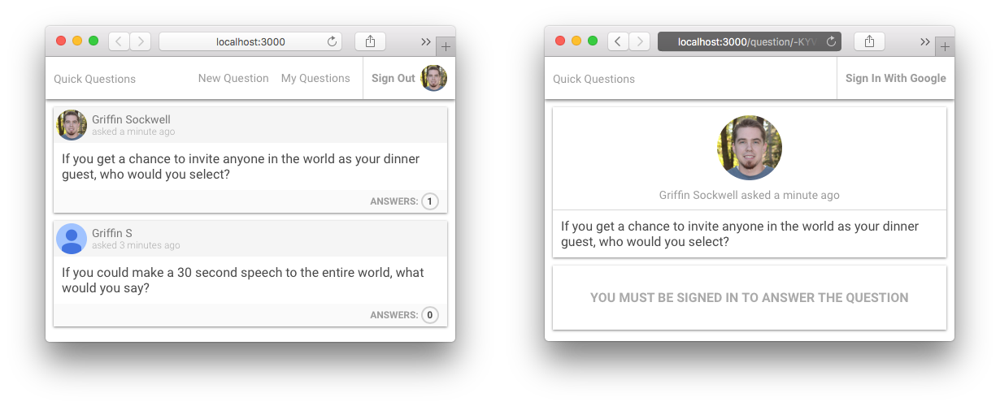
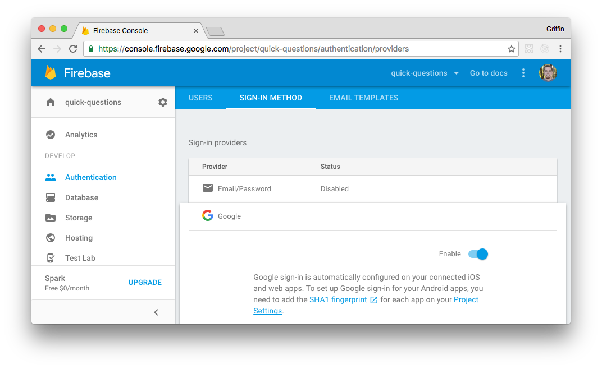

---

This is a simple app where users can ask questions and get answers from other users.

I made this app to compare local vs global state management in react. This particular repo uses [mobx](https://mobxjs.github.io/mobx/) for state management with react. To be compatible with [create-react-app](https://github.com/facebookincubator/create-react-app) without ejecting, I'm using mobx without decorators. You can find out more about using mobx without decorators [here](https://mobxjs.github.io/mobx/best/decorators.html).

You can find this same app using local state management [here](https://github.com/griffinsockwell/quick-questions-firebase-react).

You can find this same app using [redux](http://redux.js.org/) for state management [here](https://github.com/griffinsockwell/quick-questions-firebase-react-redux).

## To Run Locally

```bash
$ cd ~/Desktop
$ git clone https://github.com/griffinsockwell/quick-questions-firebase-react-mobx.git
```

Make sure [Node.js](https://nodejs.org/) is installed.

Login to [Firebase](https://console.firebase.google.com/) and create a new app from the dashboard.

Click on 'Add Firebase to your web app'

Change the firebase config in '/src/reference.js'

```js
firebase.initializeApp(<your-config-object-here>);
```

Enable an Authentication Sign-In Method with Google and then click Save.



When creating new apps the default security rules require users to be authenticated to be able to read and write to the database. Below are some quick rules to get you started.

In the firebase dashboard click on Database and then select RULES and publish these rules:

```json
{
  "rules": {
    "answers": {
      ".indexOn": "questionId",
      ".read": true,
      ".write": "auth != null"
    },
    "questions": {
      ".indexOn": "uid",
    	".read": true,
      ".write": "auth != null"
    }
  }
}
```

To learn more about firebase security check the docs [here](https://firebase.google.com/docs/database/security/).

And here are some good examples of security rules:
* [https://github.com/firebase/friendlypix/blob/master/web/database-rules.json](https://github.com/firebase/friendlypix/blob/master/web/database-rules.json)
* [https://github.com/firebase/firechat/blob/master/rules.json](https://github.com/firebase/firechat/blob/master/rules.json)
* [https://github.com/firebase/bolt/tree/master/samples](https://github.com/firebase/bolt/tree/master/samples)

Change into the correct directory.
```bash
$ cd quick-questions-firebase-react-mobx
```

Install the node modules.
```bash
$ npm install
```

Start the development server.
```bash
$ npm start
```
